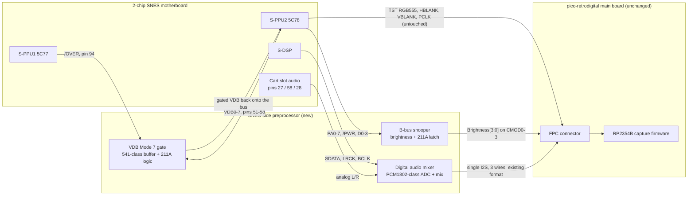

# SNES-Side Preprocessor: Requirements

## Status

Design-input document, not a schematic. It exists to pin down what the SNES-side
preprocessor board must do and why, before any KiCad work starts.

## Source tag legend

Every requirement line below carries one of these tags:

- `[thread #NN]`: a specific post in `docs/snes/shmups_thread.md`, identified by its
  `## #NN` heading. Every citation in this document was checked against that file
  with `grep` before being written down.
- `[rig YYYY-MM-DD]`: measured on our own SNES capture rig.
- `[doc: <file>]`: one of the imported reference docs in `docs/snes/`.
- `[datasheet]`: a component or platform datasheet fact.
- `[user decision]`: an explicit choice made by the user, or a report relayed by the
  user (a fellow modder's result, a Discord benchmark) that we have not independently
  reproduced.
- `[OPEN]`: not sourced. Anything tagged `[OPEN]` is a question, not a requirement,
  and is also listed in the Open Questions section.

Two tags extend this set, used only where the six above do not fit, and always
spelled out so they stay auditable:

- `[firmware: <path>]`: verified directly against this repository's current
  firmware/hardware source (for example `src/snes_pins.h`), as distinct from the
  imported `docs/snes/` reference material.
- `[external: <url>, verified YYYY-MM-DD]`: a live external source fetched and
  checked during the writing of this document.
- `[modder recipe, relayed 2026-07-27]`: the working modder's install recipe for
  the 8-pin VDB gate, relayed verbatim by the user from Discord. Field-proven on
  that modder's console, not yet reproduced on ours.

Each functional requirement is marked **MUST** (fact-grounded, not really
optional given the fact base), **PROPOSED** (a recommended design choice that is
still arguable), or **OPEN** (see above).

## 1. Purpose and scope

Define the requirements for a new SNES-side preprocessor board that consolidates
the growing pile of QSB logic (today: a 74HC688 address comparator plus 74HC175
brightness latch, and a PIXEL_VALID AND gate) into one programmable part, and
extends it to fix Mode 7 at its source instead of downstream in firmware.

Two architectural principles anchor every requirement in this document:

- Stay **out** of the video path. RGB and the sync signals (HBLANK, VBLANK, PCLK)
  pass through the FPC untouched. Mode 7's off-map garbage is fixed by gating data
  *inside the SNES*, not by blanking pixels after capture. `[user decision]`
- Stay **in** the audio path. The preprocessor digitally mixes cart-slot audio with
  the S-DSP tap and presents one I2S stream on the same 3 FPC wires the pico
  already reads. `[user decision]`

## 2. Non-goals

- Not a schematic or a bill of exact reference designators; that is follow-on work.
- Does not change `pico-retrodigital`'s firmware or FPC pinout. See section 5.
- Does not attempt an HDMI-side or scaler-side fix; the preprocessor is entirely
  on the SNES side of the FPC.
- Does not replace the existing PIXEL_VALID mask capture in firmware; that stays
  as a diagnostic and a safety net (see 4.1's disabled-state note).
- Does not commit to a final IC part number for the VDB buffer or the bus-switch
  alternative; both remain open until BOM sign-off (section 8).

## 3. System context

The video path (RGB, HBLANK, VBLANK, PCLK) is a straight pass-through. Only the
VDB bus gets touched, and only inside the SNES, before it ever reaches the FPC.

## 4. Functional requirements

### 4.1 VDB Mode 7 gate

This is the centerpiece: fixing Mode 7 off-map garbage at the source so the
capture firmware never sees it, instead of gating already-captured pixels.

- **VDB-1** (MUST, thread #104, doc: Digital_AV_Mod_Pin_Reference.md): The gate
  sits on PPU2's VDB0-7 (VRAM data bus B, pins 51-58), the same 8 pins Opatus
  lifted and rewired through a series buffer. Opatus's own description: "For the
  data on the B bus I use a SN74HCT541PW with pull-down resistors." `[thread #104]`
- **VDB-2** (MUST, user decision): A second modder independently confirmed an
  8-pin in-situ install (no PPU desoldering) works. This is a relayed report, not
  something we reproduced ourselves. `[user decision]`
- **VDB-3** (MUST, thread #87, thread #106): The gate condition cannot be /OVER
  alone. Register $211A (bits 7:6, per ikari_01's own chessdemo ROM naming:
  "OVER0", "OVER2", "OVER3" "correspond to the values of the OVER bits in
  register $211a (bits 7+6)" `[thread #87]`) selects among three Mode 7
  off-map submodes, and /OVER's low-asserted behavior differs between them:
  Opatus, describing submode selection: "the PPU1 calculates the repeated mode 7
  map in every mode[], but keeps the OVER signal high for the first mode (mode 7
  repetition). The OVER signal (when driven low) is used by the PPU1 to tell the
  PPU2 in the latter 2 modes that the processed pixel is outside of the memory
  map." `[thread #106]` In the repeat submode /OVER simply never asserts, so no
  gating is needed there; ikari_01's own remark, "You most likely don't have to
  check for mode 7 (the OVER signal can only change in mode 7)" `[thread #106]`,
  is why a full $2105 (BG mode) decode is unnecessary: /OVER's low assertion is
  already conditioned on Mode 7 being active.
- **VDB-4** (OPEN): The exact combinational split between the two non-repeat
  submodes ("draw the base color" vs "draw the first entry in the palette",
  Opatus's own wording `[thread #106]`) is not fully pinned down by the crawled
  thread. Opatus's actual working implementation forces VRAM data to 0 whenever
  /OVER is low (post #88: "making the PPU2 think it has still not left the active
  area by pulling the OVER signal high and injecting Color #0 from the VRAM"
  `[thread #88]`), and that implementation is the one krom's chessdemo validated
  as "flawless" (4.1's validation note below). Whether "inject VDB=0" is exactly
  correct for both non-repeat submodes, or only coincidentally correct because
  SNES color index 0 doubles as the backdrop color, is not established by the
  thread text alone. See Open Questions.
- **VDB-5** (MUST, thread #33): Sprites are safe from this gate by construction.
  Opatus, after physically shorting pins to test: "I can confirm that the CHAR,
  COLOR and PRIO pins are used for the sprites, at least in Mode 7." `[thread #33]`
  Sprite pixel data does not travel over VDB0-7 at all, so gating VDB cannot erase
  sprites, unlike gating on PIXEL_VALID downstream (which is pre-priority and
  cannot tell a sprite that won the mux from off-map background). A separate,
  broader claim about OBJ VRAM fetch timing (that active-display VRAM slots are
  BG-only, commonly attributed to Anomie's SNES timing notes) supports the same
  conclusion but is not present in our imported corpus and is not independently
  verified here; see Open Questions.
- **VDB-6** (MUST, thread #87, thread #94): Empirical validation exists. ikari_01
  prepared "OVER0", "OVER2", and "OVER3" krom chessdemo ROM variants specifically
  to exercise the three $211A submodes
  (<https://sd2snes.de/files/misc/sppu-digital/krom-chessdemo.7z>) `[thread #87]`,
  and reacting to Opatus's resulting video, ikari_01 wrote: "Yeah, that looks
  flawless. Awesome job!" `[thread #94]`
- **VDB-7** (MUST, modder recipe, datasheet): Disabled state (buffer output
  disabled) relies on pull-down resistors forcing the lifted pins to 0x00
  (palette index 0, transparent), matching both working implementations. Field
  data point: the modder's install uses 10 kOhm on every buffer output and works;
  their reported failure signature without pull-downs is "weird white screens
  instead of black" (a floating bus reads high). `[modder recipe, relayed
  2026-07-27]` The theoretical worst-case analysis from HM62256B-class SRAM
  datasheet numbers suggested 2.2 to 2.7 kOhm for 75 to 95 ns of margin inside
  the 186.24 ns dot; 10 kOhm working in the field implies the real RC budget is
  friendlier than that worst-case math, so treat 10 kOhm as the baseline and the
  low-kOhm range as a conservative fallback if edge artifacts appear.
  `[datasheet + research 2026-07-27]` PPU2's own pin capacitance is not published
  anywhere we have access to, so the margin has not been checked against the
  actual load. `[OPEN]`
- **VDB-8** (MUST, research note): The buffer's OE polarity (541-class parts are
  active-low OE) and the qualifying AND logic (from VDB-3) must be traced
  pin-for-pin during schematic capture; a polarity mistake here fails silently
  (bus just stays whatever the last driven value was) rather than obviously.
  `[research note]`
- **VDB-9** (PROPOSED, research 2026-07-27, rejected alternative recorded for the
  record): VRAM-side gating (drive the SRAM's own /OE) was considered and ranked
  below the VDB-buffer route. VRAM /OE and /CE are hardwired to ground on real
  boards per nesdev and lidnariq's notes (not present in our imported corpus, so
  not independently grep-verified here), meaning this route needs one lift plus a
  newly, actively-driven node; it would silence VRAM-B for every listener on the
  bus, not just PPU2, which is an unverifiable feedback risk against PPU1; and it
  has zero prior art in the thread, unlike the VDB-buffer route. `[research
  2026-07-27]`
- **VDB-10** (MUST, modder recipe, doc: Digital_AV_Mod_Pin_Reference.md): The
  buffer's input feed taps either the vacated VDB pads or the still-soldered
  EXT0-7 pads (PPU2 pins 69-76); both carry the same net because the board
  factory-straps EXT to VDB. The pin reference doc records the strap as
  bit-reversed ("EXT0-EXT7... connected to VDB7..0"), so a feed tapped at EXT
  must mirror the byte order. Tapping EXT avoids stacking a tap and a lift wire
  on the same pad. No wire harness to the VRAM chip is needed; the console's own
  strap trace is the feed. `[modder recipe, relayed 2026-07-27]` `[doc:
  Digital_AV_Mod_Pin_Reference.md]`
- **VDB-11** (MUST, modder recipe): OVER topology. The install severs the
  connection between PPU1's /OVER output and BOTH of PPU2's OVER inputs (OVER1
  and OVER2), then drives PPU2's OVER pins from the mod side: simplest is tied
  high, better is a GPIO-controlled pass-through so the preprocessor can restore
  stock behavior at will ("wire it to a GPIO like I did so you control pass
  through from PPU1"). Add a fail-safe default (pull resistor) so a dead or
  absent preprocessor leaves the console in a working state; the modder flags
  this as a known gap in their own build. `[modder recipe, relayed 2026-07-27]`
- **VDB-12** (MUST, modder recipe): The gate equation, verbatim from the working
  install: `MD7PAT = enable AND mode7 AND screen_over AND (NOT /OVER)`, where
  `mode7 = D0 AND D1 AND D2` latched on $2105 writes, and
  `screen_over = D7 AND (NOT D6)` latched on $211A writes. MD7PAT drives the
  buffer's OE (mind VDB-8's polarity trace). `[modder recipe, relayed
  2026-07-27]` Note: the modder includes the $2105 mode7 qualifier even though
  ikari_01 judged it probably unnecessary (`[thread #106]`, "You most likely
  don't have to check for mode 7"); in a programmable snooper the extra
  qualifier costs nothing and guards against the unverified corner, so include
  both qualifiers (PROPOSED).

### 4.2 B-bus snooper (replaces the 74HC688 + 74HC175)

- **SNOOP-1** (MUST, doc: Digital_AV_Mod_Pin_Reference.md): Watches PA0-7,
  `/PWR`, and D0-3 at PPU2's package pins (17-24, 6, and 15/14/13/12
  respectively) `[doc: Digital_AV_Mod_Pin_Reference.md]` to reconstruct $2100
  (INIDISP) brightness, the same signals the current 74HC688/74HC175 pair taps.
- **SNOOP-2** (MUST, rig 2026-07-26): Brightness reconstruction from these exact
  signals is hardware-validated on our own rig: monotonic 15 to 0 to 15 ramps
  through five SMW attract-mode fades, zero glitches across roughly 450 steady
  frames. `[rig 2026-07-26]`
- **SNOOP-3** (MUST, doc: Digital_AV_Mod_Pin_Reference.md): Sample once per
  scanline, at HBLANK. The doc's own reasoning: this "correctly handles both
  frame-level fades and any per-line HDMA raster effects. Sampling only once per
  frame would miss scanline-based brightness changes." `[doc:
  Digital_AV_Mod_Pin_Reference.md]`
- **SNOOP-4** (MUST, doc: Digital_AV_Mod_Pin_Reference.md): Brightness is B-bus
  only. The TST pins carry raw 5-bit RGB "before the master brightness multiplier
  is applied" `[doc: Digital_AV_Mod_Pin_Reference.md]`, and the document's entire
  brightness solution taps only `/PWR`, PA0-7, and D0-3, never VDB or the TST
  bus, so brightness cannot be recovered from either.
- **SNOOP-5** (MUST, thread #87, modder recipe): The same snooper also latches
  the VDB gate's register qualifiers (VDB-12): $211A bits 7:6 (screen-over) and
  $2105 bits 2:0 (mode7). All of these live on the same B-bus/PA/D pin group
  already being watched for brightness; the incremental taps beyond the
  brightness set are D6 and D7 only ("Tap PPU2 D0, D1, D2, D6, and D7"
  `[modder recipe, relayed 2026-07-27]`, with D0-D2 shared with the $2100
  brightness bits). No additional PPU2 pins are needed for the gate condition
  beyond `/OVER` itself (VDB-1's pin 94) and the OVER drive of VDB-11.

### 4.3 Digital audio mixer

- **AUDIO-1** (MUST, doc: 2-Chip_APU_Audio.md, doc: 2-Chip_Connectors_Pinouts.md):
  Cart-slot audio (Super Game Boy, MSU-1-class enhancement hacks) enters the
  system as analog, on cartridge edge pins 27 (AUDIO L), 58 (AUDIO R), and 28
  (AUDIO IN) `[doc: 2-Chip_Connectors_Pinouts.md]`, and is mixed with the S-DSP's
  own output only after the S-DSP's DAC, in an analog mixer/filter stage "using
  op-amps like the LM324" `[doc: 2-Chip_APU_Audio.md]`. The existing S-DSP
  digital tap (pins 44/43/42, today's GP0-2 I2S) is upstream of that mix and
  structurally cannot see cart audio.
- **AUDIO-2** (MUST, user decision): The preprocessor must take the S-DSP digital
  stream in, digitize the cart-slot analog audio, mix the two digitally, and
  present one I2S stream on the same 3 FPC wires, in the format the pico already
  consumes. This is what keeps the change invisible to the main board. `[user
  decision]`
- **AUDIO-3** (PROPOSED, firmware: src/CMakeLists.txt, firmware:
  src/audio/audio_subsystem.c): Use a PCM1802-class I2S ADC for the cart-audio
  path. PCM1802 support already exists in this repository's build heritage
  (`NEOPICO_AUDIO_MODE=PCM1802`, a standalone `pcm1802_usb_capture` diagnostic
  target, and `mvs_pins.h`/`audio_subsystem.c` wiring), so the integration
  pattern and driver code are not starting from zero. `[firmware:
  src/CMakeLists.txt]`
- **AUDIO-4** (OPEN): Mixing law (linear sum vs a headroom-aware law), output
  levels, bit-depth/headroom budget, and clock-domain handling between the
  S-DSP's roughly 32.04 kHz rate and the ADC's own clock are unresolved design
  work, not yet started. `[OPEN]`

### 4.4 TST/digital-video-enable gating (legacy risk, needs revalidation)

- **TST-1** (MUST, thread #1, doc: Digital_AV_Mod_Pin_Reference.md): The forum's
  informal "TST15" is the same physical pin the mature documentation later
  properly labeled DIGITAL VIDEO ENABLE, PPU2 pin 93. Post #1: "It was found
  that if the TST15 pin of PPU2 is pulled high then the TST0-TST14 pins are
  corresponding to the RGB video." `[thread #1]` The pin reference doc: "Master
  enable for digital RGB output... Factory-connected to GND." `[doc:
  Digital_AV_Mod_Pin_Reference.md]`
- **TST-2** (MUST, thread #22): Holding this pin permanently high, with no other
  gating, is known to break titles. Unseen: "IIRC with TST15 pulled high
  permanently, Pilotwings has a broken palette and the pendulum in the intro of
  Chrono Trigger is missing while it is still in its swinging animation phase. I
  think this applied both to the digital TST output as well as the analog one."
  `[thread #22]` The "both outputs" detail matters: this is not an artifact of
  digital capture, it reproduces on the SNES's own analog path too.
- **TST-3** (OPEN, thread #23): Opatus's mitigation attempt: "I have combined the
  HBLANK, VBLANK and PED signals to turn off the digital output when these are
  active." `[thread #23]` (`/PED` is PPU2 pin 2 `[doc:
  Digital_AV_Mod_Pin_Reference.md]`.) The crawled thread never reports back
  whether this actually fixed the Chrono Trigger pendulum; Opatus says he
  ordered a Japanese copy to test and the thread does not follow up. This
  requirement must carry `[OPEN: validate on rig with CT title]` rather than
  being assumed solved.
- **TST-4** (author's note, not a sourced requirement): our current firmware
  already blanks captured pixels using `/TRANSPARENT` (PIXEL_VALID), which per
  its own pin comment is low during "sync/burst periods, on backdrop-transparent
  pixels, and on Mode 7 out-of-map pixels" `[firmware: src/snes_pins.h]`. It is
  plausible this already substantially covers what Opatus's HBLANK/VBLANK/PED
  gating was attempting, but this has not been checked against the actual
  Chrono Trigger title screen and should not be assumed. Whether the current
  board even ties PPU2 pin 93 permanently high today is also unconfirmed in this
  document. `[OPEN]`

### 4.5 Platform and level shifting

- **PLAT-1** (PROPOSED, user decision): RP2350A. Grounds: the user's existing
  RP2350 tooling and firmware experience on this project; a Pico PIO based
  `/OVER`-to-OE gate loop was demonstrated by a fellow modder at roughly 25 ns
  reaction time, comfortably inside the 186 ns dot period, relayed by the user
  from a Discord conversation, not reproduced by us `[user decision]`; and the
  RP2350 has 3 PIO blocks (12 state machines total) `[datasheet]`, enough
  headroom for the snooper, the gate, I2S in, I2S out, and the digital mix, run
  as separate concerns. FPGA (iCE40-class) is the documented fallback if a hard
  timing-determinism wall appears during bring-up. `[user decision]`
- **PLAT-2** (MUST, firmware: src/snes_pins.h): All SNES-side signals the
  preprocessor touches are in the 5V TTL domain (confirmed for the existing QSB
  taps: the CMOD brightness lines are "buffered by a 74LVC245" `[firmware:
  src/snes_pins.h]`), so level shifting on every new tap is required, following
  the same LVC-family precedent already used on the current board.
- **PLAT-3** (MUST, firmware: src/snes_pins.h): Rework cost model, as set by the
  user: taps are cheapest, plain pin lifts are cheap, lift-and-rewire is
  expensive. The 8 lifted-and-rewired VDB pins (VDB-1) are the accepted budget
  for this project; any additional lift-and-rewire work should be weighed
  against that same bar. `[user decision]`
- **PLAT-4** (author's note): Implementing the VDB gate from the main
  pico-retrodigital board is not viable within the current FPC pin budget: only
  GP27 is spare (`[firmware: src/snes_pins.h]`), and the gate needs the B-bus
  D-bit taps, the OE line, and the OVER drive, none of which have pins to land
  on. This is part of why the preprocessor board exists. The modder has offered
  their working gate/snooper code as a contribution targeting a main-Pico
  implementation; the logic transplants to the preprocessor as-is, so the offer
  remains valuable regardless of which board hosts it.

## 5. Interface spec: FPC pin table, current vs future

| Signal | GPIO | Direction (into main board) | Changes with preprocessor? |
| --- | --- | --- | --- |
| TST RGB555 | GP33-47 | in | No. Pass-through; VDB gate is fully upstream on the SNES side. |
| PCLK | GP28 | in | No. |
| HBLANK | GP24 | in | No. |
| VBLANK | GP25 | in | No. |
| PIXEL_VALID | GP26 | in | No pin change. Semantics change: post-VDB-gate, garbage pixels no longer exist to blank, so this signal becomes diagnostic-only rather than load-bearing. `[user decision]` |
| CMOD0-3 (Brightness[3:0]) | GP29-32 | in | No. Same 4 lines, now driven by the B-bus snooper instead of the 74HC688+74HC175 pair. Bit-identical to firmware. |
| I2S (SDATA/WS/BCK) | GP0-2 | in | No pin change. Content changes: one mixed digital stream (S-DSP plus cart audio) instead of the raw S-DSP tap alone. |
| (unused) | GP27 | - | No. Confirmed unused in `src/snes_pins.h`. `[firmware: src/snes_pins.h]` |

Baseline principle, stated by the user: the `pico-retrodigital` board and
firmware require zero changes for any of this. Every preprocessor enhancement is
an invisible upgrade riding the existing pinout. `[user decision]`

## 6. Timing budget

| Item | Value | Basis |
| --- | --- | --- |
| NTSC dot clock period | 186.24 ns (from ~5.37 MHz) | `[doc: 2-Chip_Overview.md]`, arithmetic: 1 / 5.37 MHz |
| Demonstrated PIO gate reaction (`/OVER` to OE) | roughly 25 ns | `[user decision]`, relayed Discord benchmark, not reproduced on our rig |
| Derived headroom, gate reaction vs dot period | roughly 161 ns, rough only | Arithmetic (186.24 minus 25), not itself an independent measurement; does not account for setup/hold on our own hardware `[OPEN]` |
| VDB pull-down discharge margin | roughly 75 to 95 ns inside the 186.24 ns dot | `[datasheet + research 2026-07-27]`, based on HM62256B-class SRAM numbers |
| PPU2 pin capacitance (needed to check the above against the real load) | not published | `[OPEN]` |

These two margins (gate reaction latency, and pull-down RC discharge) are
different timing chains and should not be added together or conflated.

## 7. Validation plan

Every requirement above maps to a rig test. The capture rig's per-pixel mask,
per-line brightness telemetry, and the standalone firmware's `G` gating toggle
are the measurement instruments already built for this.

| Scene | Exercises | Status |
| --- | --- | --- |
| Pilotwings lesson map (screen-over transparent garbage) | VDB-3, VDB-6, TST-4 | Our own gating A/B already measured 8387 garbage pixels, exactly coinciding with mask==0, with 78.6% of mask==0 pixels already zero even ungated. `[rig 2026-07-26]` This was firmware-side (PIXEL_VALID) validation; re-run once the VDB gate exists in hardware to confirm the garbage is gone at the source. |
| krom chessdemo, OVER0/OVER2/OVER3 ROMs | VDB-3, VDB-4, VDB-6, VDB-12, Open Question 11 | Thread-level validation exists (`[thread #87]`, `[thread #94]`) on someone else's board; not yet run on ours. Directly exercises the exact submode split VDB-4 flags as open, and doubles as the probe scenario for the two-OVER-lines hypothesis. |
| Chrono Trigger title screen (pendulum) | TST-2, TST-3, TST-4 | Not run. This is the specific scene the thread's own mitigation was never confirmed against; pendulum return during the swing is the pass criterion, per `[thread #18]` (line ~308) describing the symptom. |
| SMW attract mode (brightness ramps) | SNOOP-2 | Already run. `[rig 2026-07-26]` |
| An SGB or MSU-1-class title | AUDIO-1, AUDIO-2, AUDIO-4 | Not run; no digital mixer exists yet to test. |

## 8. BOM sketch

Not a final part selection. Marked PROPOSED/OPEN throughout per the tags used
above.

- **VDB buffer**: LVC8T245 (PROPOSED, modder recipe, field-proven in the working
  8-pin install; dual-supply, so it doubles as the 5V-to-3.3V level shifter for
  these lines) with SN74HCT541PW as the thread-documented alternative (thread
  #104, Opatus's original part). A bus-switch alternative remains a category
  worth evaluating; no specific part has been checked against propagation delay
  and Ron requirements, so a bus-switch part number is `[OPEN]`.
- **B-bus snooper / VDB gate logic / audio mix**: one RP2350A (PLAT-1,
  PROPOSED), replacing the discrete 74HC688 + 74HC175 pair.
- **Cart-audio ADC**: PCM1802-class I2S ADC (AUDIO-3, PROPOSED, existing
  firmware heritage).
- **Level shifters**: LVC-family, matching current-board precedent (PLAT-2,
  MUST), exact part TBD per net count once the schematic exists. `[OPEN]`
- **VDB pull-downs**: 10 kOhm baseline (VDB-7, field-proven), 2.2 to 2.7 kOhm
  as the conservative fallback from worst-case timing math. An IC with
  integrated pull-downs would simplify the BOM; none identified yet. `[OPEN]`

## 9. Open Questions

Consolidated from every `[OPEN]` tag above, each with a proposed resolution path.

1. **VDB-4**: Is "force VDB to 0" the correct gate action for both non-repeat
   $211A submodes, or only for one of them? Resolution: run the krom chessdemo
   OVER2 and OVER3 ROMs specifically, comparing capture output to expected
   per-submode behavior, once a VDB gate prototype exists.
2. **VDB-5 supporting claim**: The "OBJ VRAM fetches happen during HBLANK,
   active-display slots are BG-only" claim (commonly attributed to Anomie's SNES
   timing notes) is not present in our imported corpus. Resolution: import or
   cite the actual Anomie timing document if it is going to be relied on as a
   hard guarantee; until then, treat VDB-6's chessdemo/thread empirical result as
   the load-bearing evidence for sprite safety, not this claim.
3. **VDB-7 / timing budget**: PPU2's pin capacitance is not published anywhere we
   have access to, so the pull-down discharge margin cannot be checked against
   the real load by math alone. The field data (10 kOhm works on the modder's
   console) bounds the answer in practice; the remaining question is only
   whether a lower value ever becomes necessary at the margins. Resolution:
   either measure it directly (scope probe on a lifted
   VDB pin with a known pull-down) or find a datasheet/die-analysis source that
   states it.
4. **Timing budget headroom**: The roughly 161 ns gate-reaction headroom is
   arithmetic from a relayed benchmark on someone else's hardware, not our own.
   Resolution: reproduce the PIO `/OVER`-to-OE reaction time measurement on our
   own RP2350 hardware before treating it as validated.
5. **AUDIO-4**: Mixing law, levels, headroom, and clock-domain handling between
   S-DSP (~32.04 kHz) and the ADC are all unstarted design work. Resolution:
   scope as its own design pass once AUDIO-3's platform choice is confirmed.
6. **TST-3 / TST-4**: The HBLANK/VBLANK/PED mitigation for the Chrono Trigger
   pendulum bug was never confirmed in the thread, and whether our current board
   even reproduces the bug (given the existing PIXEL_VALID blanking) is unknown.
   Resolution: run the Chrono Trigger title-screen validation test in section 7.
7. **BOM: bus-switch alternative to the buffer**: No specific part has been
   evaluated. Resolution: pull 2-3 candidate parts and compare propagation delay,
   Ron, and 5V tolerance against the LVC8T245 baseline (and the SN74HCT541PW
   thread precedent) before schematic capture.
8. **BOM: level shifters**: Exact part and net count depend on the final
   schematic. Resolution: defer to schematic capture, keep LVC-family as the
   working assumption.
9. **Current board's PPU2 pin 93 (DIGITAL VIDEO ENABLE) wiring**: Not confirmed
   in this document whether it is tied permanently high today. Resolution: check
   against the existing QSB schematic/BOM before the Chrono Trigger validation
   test, since it changes what that test is actually exercising.
10. **BOM: buffer with integrated pull-downs**: The modder asks whether an IC
    with built-in pull-downs exists to replace the 8 discrete resistors; none
    identified yet. Resolution: part search during BOM sign-off; discrete 10 kOhm
    resistors are the working baseline either way.
11. **Two-OVER-lines submode discrimination**: A different modder's board taps
    both OVER2 and PPU1's /OVER with no B-bus taps at all, suggesting the two
    OVER signals together may discriminate the $211A submodes without any
    register snooping. If true, the gate could drop the $211A latch entirely.
    Resolution: probe both OVER lines while running the krom chessdemo OVER2 vs
    OVER3 ROMs and compare assertion patterns.

## 10. Revision note

First draft, plus a same-day update folding in the working modder's install
recipe (relayed 2026-07-27): feed topology via the EXT-to-VDB strap (VDB-10),
OVER sever-and-drive topology (VDB-11), the explicit gate equation (VDB-12),
LVC8T245 and 10 kOhm pull-downs as field-proven BOM baselines, and the $2105
qualifier added to the snooper's latch list (SNOOP-5). Written from the
imported `docs/snes/` corpus (verified by `grep` against `shmups_thread.md`
for every thread citation), this project's own rig history, this repository's
current firmware source, and the relayed modder recipe. No schematic work has
started; this document is the input to that work, not a substitute for it.
